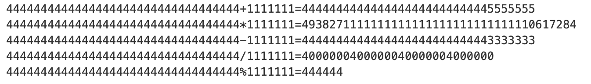

# 大整數四則運算

有些整數大到連unsigned long long 都放不下。
例如：`912849012847128945789127658912768745789217`

**計算兩輸入整數的四則運算以及餘數**

### input
```
整數1 整數2
```

### test case:
```yaml
4444444444444444444444444444444444 1111111
```

### output:


### code
```cpp
#include <cstring>
#include <vector>
#include <iostream>

using namespace std;

class Integer {
    private:
        std::string value;
        int fillZero(std::string&, std::string&);
        Integer div(Integer, Integer, bool);
    public:
        Integer(std::string);
        friend std::ostream& operator<<(std::ostream&, const Integer&);
        
        bool operator<(Integer); // compare
        bool operator>(Integer); // compare
        Integer& operator+=(Integer);
        Integer operator+(Integer);
        Integer operator-(Integer);
        Integer operator*(Integer);
        Integer operator/(Integer);
        Integer operator%(Integer);
};

int Integer::fillZero(std::string& a, std::string& b) {
    int max = a.size();
    if (a.size() != b.size()) {
        max = a.size() > b.size()
            ? a.size()
            : b.size();
            
        if (a.size() < max) {
            for (int i=a.size(); i < max; i++) {
                a = "0" + a;
            }
        } else {
            for (int i=b.size(); i < max; i++) {
                b = "0" + b;
            }
        }
    }
    return max;
}

Integer::Integer(std::string value="0") {
    this->value = value;
}

Integer Integer::div(Integer a, Integer b, bool getRem) {
    vector<Integer> c;
    c.push_back(b);
    
    Integer two = Integer("2");
    Integer division;
    Integer remainder;
    
    while (b < a) {
        b = b * two;
        if (b < a) c.push_back(b);
    }
    
    remainder = a;
    
    for (int i= c.size() - 1; i >= 0; i--) {
        while (remainder > c[i]) {
            remainder = remainder - c[i];
            
            Integer tmp2("1");
            for (Integer j; j < Integer(to_string(i)); j = j + Integer("1")) {
                tmp2 = tmp2 * two;
            }
            division = division + tmp2;
        }
    }
    
    if (getRem) return remainder;
    else return division;
}

std::ostream& operator<<(std::ostream& o,const Integer& self) {
    o << self.value;
    return o;
}

bool Integer::operator<(const Integer other) {
    if (this->value.size() < other.value.size()) return true;
    else if (this->value.size() == other.value.size()) {
        for (int i=0; i < this->value.size(); i++) {
            if (this->value[i] < other.value[i]) return true;
            else if (this->value[i] > other.value[i]) return false;
        }
    } else return false;
}

bool Integer::operator>(const Integer othter) {
    return !(*this < othter);
}

Integer Integer::operator+(Integer other) {
    Integer tmpThis = Integer(this->value);
    int max = fillZero(tmpThis.value, other.value);
    
    int carry = 0;
    std::string tmp;
    for (int i = max - 1; i >= 0; i--) {
        int a = tmpThis.value[i] - '0';
        int b = other.value[i] - '0';
        tmp = std::to_string((a+b+carry) % 10) + tmp;
        carry = (a+b+carry) / 10;
    }
    
    if (carry != 0) {
        tmp = std::to_string(carry) + tmp;
    }
    
    return Integer(tmp);
}

Integer Integer::operator*(Integer other) {
    Integer tmpThis = Integer(this->value);
    if (tmpThis.value == "0" || other.value == "0") return Integer("0");
    
    if (tmpThis.value.size() < other.value.size()) {
        swap(tmpThis.value, other.value);
    }
    
    vector<Integer> c;
    int where = 0;
    for (int i = other.value.size() - 1; i >= 0; i--) {
        int carry = 0;
        string tmp;
        
        for (int j = tmpThis.value.size() - 1; j >= 0; j--) {
            int a = tmpThis.value[j] - '0';
            int b = other.value[i] - '0';
            int sum = ((a * b) + carry) % 10;
            
            tmp = to_string(sum) + tmp;
            
            carry = ((a * b) + carry) / 10;
        }
        
        if (carry != 0) {
            tmp = to_string(carry) + tmp;
        }
        
        for (int t = 0; t < where; t++) {
            tmp += "0";
        }
        
        where++;
        
        c.push_back(tmp);
    }
    
    Integer total;

    for (int i = 0; i < c.size(); i++)
    {
        total = total + c[i];
    }
    
    return total;
}

Integer Integer::operator-(Integer other) {
    if (this->value == other.value) return Integer("0");
    
    Integer tmpThis = Integer(this->value);
    
    bool neg = false;
    
    if (tmpThis < other) {
        neg = true;
        swap(tmpThis.value, other.value);
    }
    
    int max = fillZero(tmpThis.value, other.value);
    
    string tmp;
    for (int i=max - 1; i >= 0; i--) {
        int a = tmpThis.value[i] - '0';
        int b = other.value[i] - '0';
        
        if ((a - b) < 0) {
            int sum = a - b + 10;
            int front = tmpThis.value[i-1] - '0';
            tmpThis.value[i-1] = (front - 1) + '0';
            tmp = to_string(sum) + tmp; 
        } else {
            tmp = to_string(a - b) + tmp;
        }
    }
    
    for (int i = 0; i < tmp.size(); i++) {
        if (tmp[i] == '0') tmp[i] = '\0';
        else break;
    }
    
    string tmp2;
    for (int i=0; i < tmp.size(); i++) {
        if (tmp[i] != '\0') {
            tmp2 += tmp[i];
        }
    }
    
    if (neg) {
        tmp2 = "-" + tmp2;
    
    }
    return Integer(tmp2);
}

Integer Integer::operator/(Integer other) {
    Integer tmpThis = Integer(this->value);
    
    return div(tmpThis, other, false);
}

Integer Integer::operator%(const Integer other) {
    Integer tmpThis = Integer(this->value);
    
    return div(tmpThis, other, true);
}

int main() {
    string i1, i2;
    
    while(cin >> i1 >> i2) {
        
        Integer a(i1), b(i2);
        cout << i1 << "+" << i2 << "=" << a + b << endl;
        cout << i1 << "*" << i2 << "=" << a * b << endl;
        cout << i1 << "-" << i2 << "=" << a - b << endl;
        cout << i1 << "/" << i2 << "=" << a / b << endl;
        cout << i1 << "%" << i2 << "=" << a % b << endl;
    }
    
    return 0;
}
```