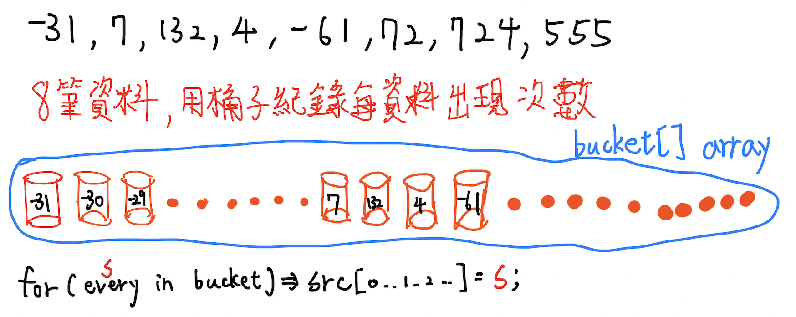

*排序輸入數字大小*

### input
```
幾筆數值
數值1 數值2...數值n 數值n+1
```

### test case:
```yaml
8
-31 7 132 4 -61 72 724 555
```

### output:
```
-61 -31 4 7 72 132 555 724
```

### code
```cpp
#include <iostream>

using namespace std;

int main() {
    int len; // 輸入資料數量
    cin >> len;
    
    int list[len];
    
    int max = 0; // 紀錄輸入資料最大的值
    int min = 0; // 紀錄輸入資料最大的值
    for (int i=0; i < len; i++) {
        cin >> list[i];
        max = max < list[i] ? list[i] : max;
        min = min > list[i] ? list[i] : min;
    }
    
    int bucketLength = min < 0 ? max + abs(min) + 1 : max + 1; // 紀錄bucket所需要的空間大小
    int bucket[bucketLength] = {0};
    
    int haveSmallZero = 0; // 有無小於0的數值
    if (min < 0) { // 有就平移讓最小值為 0
        for (int i=0; i < len; i++) {
            list[i] += abs(min);
        }
        haveSmallZero = 1;
    }
    
    for (int i=0; i < len; i++) {
        bucket[list[i]]++; // 紀錄相對應index的出現次數
    }
    
    int index = 0;
    for (int i=0; i < bucketLength; i++) {
        while (bucket[i] > 0) { // 避免等值的數值出現兩次
            list[index++] = i;
            bucket[i]--;
        }
    }
    
    for (auto evy : list) {
        if (haveSmallZero) cout << evy - abs(min) << " ";
        else cout << evy << " ";
    }

    return 0;
}
```