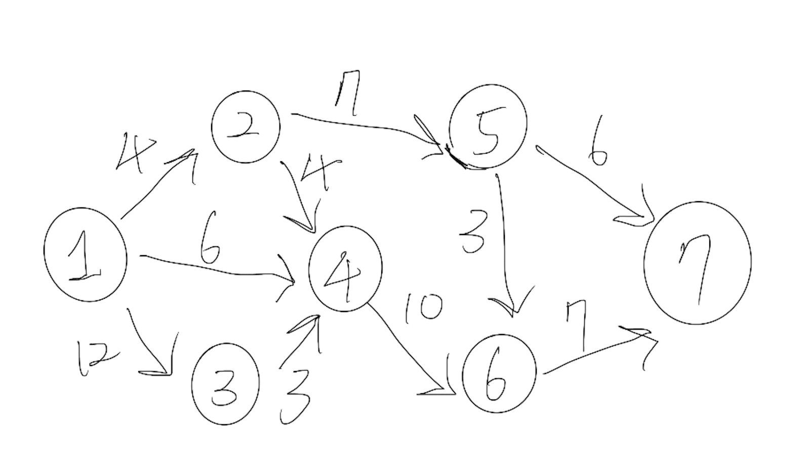

參考：
- [IT鐵幫人- [演算法] 最短路徑 (Dijkstra 演算法)](https://ithelp.ithome.com.tw/articles/10209593)



*找出點 1 到 點 7 的最短路徑。*

### input
```
第一行輸入=> 幾個點 l
第二行輸入=> 點與點之間共有幾條路線 n

第三行以後=> 輸入 n 條路線 (起始點, 到目的點, 的距離)
```

### test case:
```yaml
7
10
1 2 4 
1 3 12
1 4 6
2 4 4
2 5 7
3 4 3
4 6 10
5 6 3
5 7 6
6 7 7
```

### output:
```
17
```

### code:
```cpp
#include <iostream>

using namespace std;

int main() {
	const int oo = 9999999; // 無限大
	
	int len; // 點的數量
	cin >> len;

	int all[len][len]; // 紀錄點跟點之間的距離
	
	int dis[len] = {0}; // 初始點(index = 0)到各點之間的距離

    // 自己到自己的距離設置為0，其餘為無限大
	for (int i=0; i < len; i++) { 
		for (int j=0; j < len; j++) {
			if (i == j) all[i][j] = 0;
			else all[i][j] = oo;
		}
	}

	int roads; // 點跟點之間有幾條路線
	cin >> roads;
    
    // 輸入點到點之間的距離
	for (int i=0; i < roads; i++) {
		int src, to, r; // 點A, 到點N, 的距離
		cin >> src >> to >> r;
		
		all[src - 1][to - 1] = r; 
	}
    
    // 紀錄起始點(index = 0) 到各點的距離
	for (int i=0; i < len; i++) {
		dis[i] = all[0][i];
	}
	
	int ok[len] = {0}; // 紀錄 起始點(index = 0) 到其他點的是否走過
	ok[0] = 1; // 自己走到自己就是 0 ，所以走過了

    // Dijkstra algorithm
	for (int i=0 ; i < len; i++) { 
		int u = 0; // 紀錄 從起始點到其他點的初始位置
		
		for (int j=0; j < len; j++) {
			if (ok[j] == 0 && dis[j] < oo) { // 代表 j 這個位置還沒走到過
				u = j;
			}
		}

		for (int j=0; j < len; j++) {
			if (all[u][j] < oo) { // u 點到 j 點必須有路線
                
				/* 如果從 (起始點(index = 0) 到 j 點的距離) > 從 (起始點(index = 0) 到 u 點) + 從(u 點到 j 點)
				    就做鬆弛，代表從 (起始點(index = 0) 到 u 再到 j 點)的距離，
				    會比直接從 (起始點(index = 0) 到 j 點來得短)
				*/
				if (dis[j] > dis[u] + all[u][j]) { 
					dis[j] = dis[u] + all[u][j]; // 鬆弛
				}
			}
		}
		
		ok[u] = 1; // 標記為走過
	}
	
	for (auto s : dis) cout << s << " "; // 印出來
	return 0;
}
```